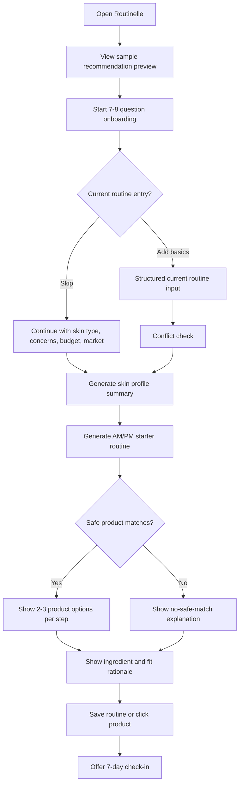
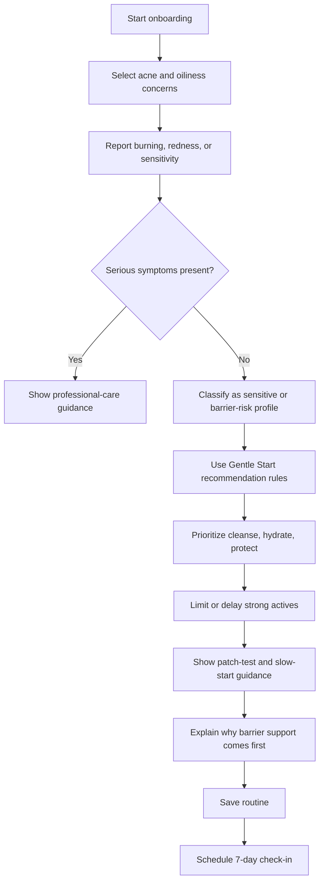
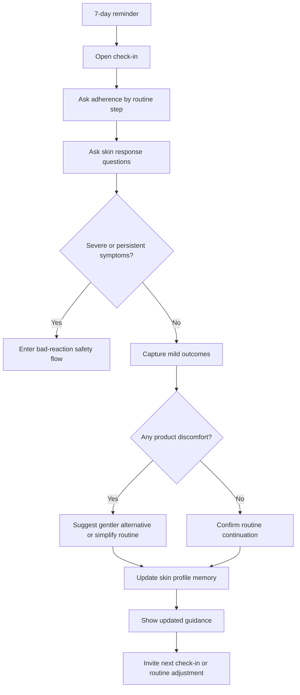
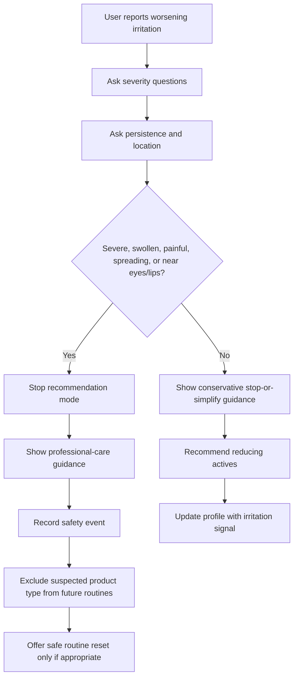

# UX Design Specification sale_assistant

**Author:** Long
**Date:** 2026-05-11

---

<!-- UX design content will be appended sequentially through collaborative workflow steps -->

## Executive Summary

### Project Vision

Routinelle is a mobile-first skincare guidance product that helps confused skincare shoppers get a safe, understandable, locally buyable starter routine in under 5 minutes. The UX must make the product feel neutral, trustworthy, and calm rather than sales-driven, influencer-like, or medical-diagnostic.

The first experience should prove one job: the user answers a short questionnaire, receives a credible AM/PM routine, understands why each step and product fits, and knows what to do next.

### Target Users

Primary users:

- Confused skincare shoppers who do not know which products or ingredients to trust.
- Acne-prone users who may have overused strong actives and damaged their skin barrier.
- Sensitive-skin users who fear irritation, burning, or redness.
- Budget-conscious users who want effective routines without wasting money.

Secondary users:

- Returning users completing a 7-day outcome check-in.
- Internal catalog/admin users maintaining product data and recommendation rules.
- Users reporting bad reactions who need conservative, non-diagnostic guidance.

### Key Design Challenges

- **Trust before account commitment:** Users should see value before being forced to create an account.
- **Short but credible onboarding:** The questionnaire must feel lightweight while collecting enough information for useful recommendations.
- **Safety without fear:** Warning, triage, and Gentle Start copy must protect users without sounding medical, alarming, or judgmental.
- **Explainability without overload:** Ingredient and product rationale must be clear enough to build confidence without turning routine cards into dense articles.
- **Mobile-first clarity:** Routine steps, product options, warnings, and save/click actions must remain scannable on small screens.
- **Neutrality proof:** Users must understand that recommendations are based on fit, not brand payments.

### Design Opportunities

- **Sample recommendation preview:** Show output quality before asking for data or account commitment.
- **Progressive disclosure:** Start with a simple routine view, then reveal ingredient details, cautions, and alternatives on demand.
- **Confidence-building routine cards:** Each step can show what to use, when, why it matters, and what product options fit.
- **Gentle Start experience:** Sensitive/acne-prone users can visibly receive a calmer routine path with fewer actives and stronger reassurance.
- **Outcome loop:** The 7-day check-in can make the app feel adaptive and personal, not one-time.
- **Privacy-forward onboarding:** Clearly show what data is required, what is optional, and why it improves recommendations.

## Core User Experience

### Defining Experience

The defining experience is the first routine generation flow:

**sample preview -> short onboarding -> skin profile -> AM/PM routine -> product rationale -> save/click -> 7-day check-in**

The user should feel guided, not tested. Routinelle should behave like a calm skincare analyst that translates skin needs, budget, ingredient fit, and local availability into a clear next step.

The core user action to get right is: **complete onboarding and understand what to buy/use next.**

### Platform Strategy

Routinelle should be designed as a **mobile-first responsive web/PWA experience** for MVP.

Platform decisions:

- Primary interaction is touch-based mobile use.
- MVP should work well on modern iOS Safari and Android Chrome.
- Native app is not required for MVP unless app-store distribution becomes a launch requirement.
- Offline routine viewing can be considered later; routine generation and product availability require network access.
- Camera/photo permissions should not be required for MVP.
- Push notifications should not appear during first onboarding; reminders should be introduced after the user sees value and saves a routine.

### Effortless Interactions

These interactions should feel natural and low-effort:

- Starting from a sample recommendation preview.
- Completing 7-8 onboarding questions without feeling medically interrogated.
- Skipping current routine entry without penalty.
- Reading the AM/PM routine at a glance.
- Understanding why each product was recommended.
- Seeing safety cautions without feeling alarmed.
- Saving the routine after value is shown.
- Completing the 7-day check-in with minimal friction.
- Seeing that recommendations are neutral and not paid placement.

### Critical Success Moments

The make-or-break UX moments are:

1. **First impression:** User believes this is a trusted skincare consultant, not a sales funnel.
2. **Onboarding start:** User feels the questionnaire is short, relevant, and respectful.
3. **Routine reveal:** User receives a complete routine and understands what to do tomorrow morning/evening.
4. **Explanation moment:** User sees why recommendations fit their skin and budget.
5. **Safety moment:** Sensitive or irritated users receive calm conservative guidance, not fear.
6. **Action moment:** User saves the routine or clicks a product because it feels useful.
7. **Return moment:** User completes the 7-day check-in and feels the app is learning from real skin response.

### Experience Principles

- **Trust before commitment:** Show value before forcing account creation.
- **Guidance over diagnosis:** Use cosmetic skincare language, not medical assessment language.
- **Clarity before depth:** Start with the routine; reveal ingredient details progressively.
- **Calm safety:** Warnings should protect users without creating anxiety.
- **Neutrality visible:** Make recommendation independence easy to understand.
- **Mobile-first brevity:** Every screen should be scannable, touch-friendly, and focused.
- **Adaptive over time:** The experience should feel more personal after check-ins and outcomes.

## Desired Emotional Response

### Primary Emotional Goals

Routinelle should make users feel **calm, understood, and confidently guided**.

The most important emotional shift is from:

**"I am confused and afraid of wasting money or damaging my skin"**
to
**"I understand what my skin needs, why this routine fits me, and what to do next."**

Users should feel that Routinelle is a neutral skincare consultant that helps them make better choices, not another beauty influencer, sales assistant, or brand promotion channel.

### Emotional Journey Mapping

- **First discovery:** The user should feel curious and reassured. The product should immediately communicate that it is practical, neutral, and focused on solving skin concerns.
- **Before onboarding:** The user should feel safe to try it because the first routine is free, the questionnaire is short, and the app does not overclaim medical diagnosis.
- **During onboarding:** The user should feel that each question is relevant, easy to answer, and respectful. They should not feel judged or medically examined.
- **Routine reveal:** The user should feel relief and clarity. The AM/PM routine should look simple enough to start tomorrow.
- **Explanation moment:** The user should feel smarter and more in control because ingredients, product fit, and routine conflicts are explained in plain scientific language.
- **Safety moment:** If the user reports burning, swelling, severe redness, or possible allergy, they should feel protected, not frightened. The app should calmly explain when to stop actives or see a dermatologist.
- **After saving/clicking products:** The user should feel that they saved time, avoided unsuitable products, and made a more rational purchase decision.
- **Returning after 7 days:** The user should feel that Routinelle remembers their skin response and improves future recommendations.

### Micro-Emotions

The critical micro-emotions to design for are:

- **Trust over skepticism:** Show why recommendations are made and avoid hidden brand pressure.
- **Confidence over confusion:** Use simple routine structure before ingredient depth.
- **Relief over anxiety:** Especially for acne-prone, oily, or irritated users.
- **Control over overwhelm:** Let users compare options without flooding them.
- **Respect over judgment:** Avoid language that makes users feel their current routine was "wrong."
- **Safety over excitement:** For sensitive or irritated skin, conservative guidance matters more than impressive active ingredients.
- **Progress over perfection:** The 7-day check-in should make improvement feel realistic, not instant.

### Design Implications

- **Calm and understood** -> Use concise questions, soft guidance copy, and a visible progress indicator.
- **Trustworthy** -> Show ingredient rationale, product fit criteria, and neutrality statements near recommendations.
- **Confident** -> Present the routine first as Cleanse, Hydrate, Protect before showing deeper details.
- **Safe** -> Use Gentle Start paths, irritation warnings, and dermatologist referral language for serious symptoms.
- **Not sales-driven** -> Separate recommended products from sponsored or partner content; explain that fit comes before brand.
- **Adaptive** -> Use check-ins and outcome tracking so the app feels like it learns, not like a one-time quiz.
- **Efficient** -> Keep the first successful routine flow under 5 minutes.

### Emotional Design Principles

1. **Make skincare feel solvable.**
   The user should leave with a concrete next step, not more uncertainty.

2. **Explain without overwhelming.**
   Scientific ingredient explanations should be clear, short, and expandable.

3. **Protect trust aggressively.**
   Neutrality, safety limits, and evidence boundaries should be visible in the experience.

4. **Reduce fear around irritation.**
   The app should calmly distinguish common cosmetic irritation signals from serious symptoms that require professional care.

5. **Reward honest feedback.**
   Outcome tracking should show users that reporting bad reactions or no improvement makes the next recommendation better.

6. **Prioritize long-term skin confidence over product excitement.**
   The UX should not push too many actives, trends, or anti-aging products too early.

## UX Pattern Analysis & Inspiration

### Inspiring Products Analysis

**Yuka**

Yuka is useful inspiration because it turns complex product information into a fast, understandable decision. Users do not need to understand every ingredient before they get a first answer.

What Routinelle can learn:

- Use clear product fit signals instead of overwhelming ingredient lists.
- Explain why something is suitable or risky in plain language.
- Make trust visible through transparent criteria.
- Keep the first result simple, then allow deeper detail.

Routinelle should not copy a single "good/bad" score too aggressively because skincare fit depends on skin type, irritation risk, routine context, and user goals.

**Sephora / Nocibe Product Browsing**

Beauty retail apps are useful because users already understand product cards, filters, brands, reviews, prices, and availability.

What Routinelle can learn:

- Product cards should include brand, product type, price range, key benefits, and availability.
- Filters can help users refine by budget, sensitivity, cruelty-free, natural/bio preference, dermatologist-tested, or local accessibility.
- Product comparison should be visual and scannable.

Routinelle should avoid feeling like a store homepage. The routine and skin need must lead; products should support the routine.

**Duolingo-Style Habit Loop**

Duolingo is useful for return behavior, not visual tone. It shows how small check-ins, reminders, progress, and lightweight streak-like mechanics can keep users engaged.

What Routinelle can learn:

- Make the 7-day check-in very easy.
- Reward completion with improved recommendations, not artificial points.
- Use reminders after value is proven, not during first onboarding.
- Create a feeling of progress without promising instant skin transformation.

Routinelle should avoid playful pressure, guilt, or over-notification because skincare improvement is slower and more sensitive than daily learning.

### Transferable UX Patterns

- **Simple result first, details second:** Show the recommended AM/PM routine before ingredient science.
- **Expandable explanation:** Use "Why this fits you" sections for ingredients, skin type fit, and routine conflicts.
- **Fit badges:** Use badges such as "Barrier-friendly," "Acne-prone fit," "Low irritation risk," "Budget fit," or "Locally available."
- **Neutral recommendation criteria:** Show that recommendations are based on skin profile, concern, budget, ingredients, and availability.
- **Guided product cards:** Product cards should explain the role in the routine, not only product marketing benefits.
- **Short check-in loop:** Ask what changed, what irritated, what improved, and whether the user continued the routine.
- **Safety routing:** When serious symptoms appear, shift from recommendation mode to conservative guidance and dermatologist referral.

### Anti-Patterns to Avoid

- **Too many product choices:** This recreates the confusion users already have in stores.
- **Influencer-style claims:** Avoid language like "miracle," "must-have," "perfect skin," or "viral."
- **Medical diagnosis tone:** Routinelle should not claim to diagnose acne, allergy, dermatitis, rosacea, or other medical conditions.
- **Over-scoring products:** A single score may oversimplify skincare and reduce trust.
- **Early account wall:** Asking for signup before showing value will weaken trust.
- **Aggressive reminders:** Lifestyle nudges should not feel judgmental or intrusive.
- **Hidden sponsored influence:** Any partner or affiliate relationship must not affect routine logic invisibly.
- **Ingredient overload:** Scientific explanation should support decisions, not become a textbook.

### Design Inspiration Strategy

**What to Adopt**

- From Yuka: clear product transparency, simple explanations, and confidence-building criteria.
- From beauty retailers: familiar product cards, filtering, price visibility, and local availability.
- From habit apps: lightweight check-ins and progress continuity.

**What to Adapt**

- Product scoring should become **personal fit reasoning**, not universal good/bad judgment.
- Shopping filters should be secondary to routine guidance.
- Habit mechanics should feel calm and adult, focused on skin response and consistency.

**What to Avoid**

- Avoid marketplace-first layouts where brands dominate the experience.
- Avoid medical-looking diagnostic flows that create fear or legal risk.
- Avoid gamification that makes serious irritation or acne feel trivial.
- Avoid trend-led recommendations that push actives before the user's barrier is stable.

**Recommended Inspiration Direction**

Routinelle should feel like:

**Yuka's clarity + Sephora's product familiarity + a calm clinical skincare notebook**

The UX should be neutral, structured, and reassuring, with enough beauty familiarity to feel approachable.

## Design System Foundation

### 1.1 Design System Choice

Routinelle should use a **themeable design system foundation**, rather than a fully custom system or a generic off-the-shelf visual style.

Recommended approach:

**Tailwind CSS + a small custom component layer**

This gives the MVP a fast, flexible foundation while allowing the product to develop its own calm skincare identity.

The design system should support:

- Mobile-first responsive web/PWA experience.
- Short questionnaire flow.
- AM/PM routine cards.
- Product recommendation cards.
- Ingredient explanation panels.
- Safety and dermatologist referral notices.
- Outcome check-in UI.
- Admin/catalog review screens later.

### Rationale for Selection

A fully custom design system is too heavy for MVP. Routinelle needs to validate trust, recommendation quality, onboarding completion, and product click behavior before investing deeply in unique UI infrastructure.

A generic established system such as Material Design could speed development, but may feel too app-like, clinical, or generic for a skincare product that needs emotional trust and beauty-market familiarity.

A themeable system gives the best balance:

- **Speed:** Components can be built quickly.
- **Trust:** UI can be consistent and accessible.
- **Brand flexibility:** Routinelle can feel calm, intelligent, and skincare-specific.
- **Mobile quality:** Layout can be optimized tightly for small screens.
- **Long-term growth:** Components can evolve into a fuller design system after MVP validation.

### Implementation Approach

The MVP design system should begin with a small, disciplined set of reusable components:

- **Questionnaire components:** single-choice cards, multi-select chips, sliders, progress indicator, "not sure" option.
- **Routine components:** AM/PM routine sections, step cards, product role labels, use-frequency labels.
- **Product components:** product card, fit badges, price/local availability, ingredient highlights, caution labels.
- **Explanation components:** expandable "Why this fits you," ingredient rationale, routine conflict explanation.
- **Safety components:** gentle warnings, serious-symptom referral message, no-safe-match state.
- **Tracking components:** 7-day check-in, skin response options, irritation report, improvement summary.
- **Trust components:** neutrality statement, recommendation criteria summary, evidence boundary note.

Design tokens should be defined early for:

- Colors
- Typography
- Spacing
- Border radius
- Button states
- Badge styles
- Alert severity levels
- Card hierarchy
- Form controls

### Customization Strategy

Routinelle's UI should feel calm, professional, and skincare-specific without looking like a hospital system or a beauty influencer brand.

Recommended visual direction:

- **Tone:** clean, calm, neutral, quietly premium.
- **Color:** soft neutral base with restrained skincare-relevant accents; avoid heavy pink, purple, or cosmetic trend palettes.
- **Typography:** highly readable, modern, and friendly.
- **Cards:** used for routine steps and product options, not for every page section.
- **Badges:** used to communicate fit clearly, such as "Barrier-friendly," "Low irritation risk," "Budget fit," and "Locally available."
- **Warnings:** visually distinct but calm; avoid red unless symptoms are serious.
- **Scientific explanation:** structured in short layers, not long paragraphs by default.
- **Brand expression:** should come from clarity, neutrality, and confidence, not decorative visuals.

### Design System Principle

The design system should make the product feel like:

**a calm skincare consultant with product intelligence**

Not:

- a beauty store homepage,
- a medical diagnosis tool,
- an influencer routine generator,
- or a generic chatbot.

## 2. Core User Experience

### 2.1 Defining Experience

The defining experience for Routinelle is:

**"Tell Routinelle about your skin, then get a clear AM/PM routine with product recommendations and scientific explanations you can trust."**

This is the interaction that must feel excellent. If the user completes the questionnaire and says, "Now I finally know what to use and why," the product succeeds.

The core user action is not browsing products. It is **turning skin confusion into a confident routine decision**.

The experience should feel like:

1. The user gives a small amount of skin context.
2. Routinelle identifies their likely routine needs and risk areas.
3. The app creates a simple starter routine.
4. Each step explains why it fits.
5. The user can save, buy, or check back after 7 days.

### 2.2 User Mental Model

Users currently solve this problem through:

- Asking store assistants.
- Watching beauty influencers.
- Searching TikTok, YouTube, Reddit, or blogs.
- Trying products from Sephora, Nocibe, pharmacies, or para-pharmacies.
- Copying routines from friends.
- Buying products based on claims like "anti-acne," "glow," "repair," or "anti-aging."

Their mental model is often:

**"I have a skin issue, so I need the right product."**

Routinelle should gently shift this to:

**"I need the right routine structure, then the right product for each role."**

Common confusion points:

- Users may not know whether their skin is oily, combination, dehydrated, irritated, or acne-prone.
- Users may think more active ingredients means better results.
- Users may not understand product conflicts, such as too many exfoliants or actives.
- Users may confuse irritation with purging or acne worsening.
- Users may not know when symptoms require dermatologist advice.
- Users may distrust recommendations if the app feels like it is selling a brand.

### 2.3 Success Criteria

The defining experience succeeds when:

- The user completes onboarding in under 5 minutes.
- The user understands their recommended routine at a glance.
- The user can explain why each step is included.
- The user sees product options that match budget and local availability.
- The user understands if their current routine has conflicts.
- The user sees clear safety guidance if irritation or serious symptoms are reported.
- The user trusts that recommendations are based on skin needs, not brand KPI.
- The user saves the routine, clicks a product, or returns for the 7-day check-in.

The "this just works" moment is:

**"This app understands my skin situation and gives me a routine I can actually follow."**

### 2.4 Novel UX Patterns

Routinelle should mostly use familiar patterns, combined in a more trustworthy way.

Established patterns to use:

- Quiz-style onboarding.
- Product recommendation cards.
- Expandable explanation sections.
- Badges for product fit.
- Routine checklist format.
- Save routine action.
- Follow-up check-in.

Routinelle's unique twist:

- Recommendations are organized by **routine role**, not brand marketing.
- Product suggestions include **ingredient rationale and irritation risk**.
- The app explains **routine conflicts**, not only product benefits.
- The system can say **no safe match** instead of forcing a recommendation.
- Check-ins improve future recommendations rather than only tracking habit completion.

The experience does not need a strange new interaction model. Its differentiation should come from **decision quality, clarity, neutrality, and safety boundaries**.

### 2.5 Experience Mechanics

**1. Initiation**

The user starts from a sample recommendation preview or a "Build my routine" action.

The first screen should quickly prove value:

- "Get a simple AM/PM skincare routine based on your skin type, concerns, budget, and local product availability."
- No account required before the first routine.
- Clear statement that Routinelle gives cosmetic skincare guidance, not medical diagnosis.

**2. Questionnaire Interaction**

The questionnaire should use 7-8 short questions:

- Skin type.
- Main concerns.
- Sensitivity/irritation tendency.
- Current routine or current product types.
- Budget.
- Product preferences.
- Location/availability.
- Safety symptoms or dermatologist referral triggers.

Controls should be simple:

- Single-choice cards.
- Multi-select chips.
- "Not sure" option.
- Optional current routine entry.
- Progress indicator.

**3. System Response**

After submission, Routinelle generates:

- Skin profile summary.
- AM routine.
- PM routine.
- Product options for each routine step.
- Ingredient rationale.
- Routine conflict warnings.
- Gentle Start recommendations if sensitivity or irritation risk is high.
- Dermatologist referral message if serious symptoms are selected.

**4. Feedback**

The user should know the recommendation is working because the app shows:

- "Why this routine fits you."
- "What we avoided."
- "What to watch for."
- "How to start gently."
- "Check in after 7 days."

**5. Completion**

The user completes the flow when they:

- Save the routine.
- Click a recommended product.
- Mark products they already own.
- Set a 7-day check-in reminder.
- Or exit with the routine visible.

The successful outcome is not only a product click. It is the user feeling clear, safe, and ready to start.

## Visual Design Foundation

### Color System

Routinelle should use a soft neutral foundation with restrained clinical-skincare accents.

Recommended color direction:

- **Base:** warm off-white / soft ivory for page backgrounds.
- **Surface:** clean white for cards, routine blocks, and product panels.
- **Primary:** muted sage or botanical green for main actions and trust signals.
- **Secondary:** soft mineral blue for scientific explanations, hydration, and guidance.
- **Accent:** gentle peach or warm beige for mild highlights, not dominant branding.
- **Success:** calm green for positive fit or progress.
- **Warning:** soft amber for caution, irritation risk, or "start slowly."
- **Error/Serious:** controlled red only for serious symptoms, stop-use messages, or dermatologist referral.

The palette should avoid:

- Heavy pink beauty branding.
- Strong purple/purple-blue tech gradients.
- Dark clinical navy dominance.
- Overly beige spa-style visuals.
- Bright influencer-style colors.

The color system should support trust first, beauty second.

### Typography System

Typography should feel modern, readable, and quietly professional.

Recommended approach:

- **Primary font:** a clean sans-serif with strong readability.
- **Tone:** friendly but precise.
- **Headings:** clear and calm, not oversized or dramatic.
- **Body text:** optimized for ingredient explanations and safety guidance.
- **Labels/badges:** compact, highly legible, and consistent.
- **Routine text:** easy to scan on mobile.

Typography should support three reading levels:

1. **Fast scan:** routine step, product role, fit badge.
2. **Short explanation:** why this product fits.
3. **Deeper detail:** ingredient rationale, conflict explanation, safety boundary.

Text should not feel like medical paperwork or marketing copy. It should feel like a professional skincare consultant explaining clearly.

### Spacing & Layout Foundation

Routinelle should use a clean mobile-first layout with moderate spacing.

Recommended layout principles:

- Use an **8px spacing system**.
- Keep questionnaire screens focused on one decision at a time.
- Use full-width mobile sections rather than nested cards.
- Use cards only for routine steps, product options, alerts, and check-in blocks.
- Keep AM/PM routine structure visually clear.
- Keep primary actions sticky or easy to reach on mobile when appropriate.
- Use expandable sections for ingredient detail to avoid overwhelming users.

The layout should feel:

- calm,
- scannable,
- structured,
- efficient,
- and safe for users who are already confused.

### Accessibility Considerations

Accessibility should be included from MVP, especially because users may read product advice on mobile screens in stores.

Requirements:

- Strong contrast for all body text and buttons.
- Do not rely on color alone for warnings or product fit.
- Clear labels for form options and product badges.
- Tap targets large enough for mobile use.
- Avoid tiny ingredient text.
- Use plain language for warnings and safety messages.
- Support "not sure" answers in questionnaire flow.
- Keep serious symptom guidance easy to notice and understand.
- Avoid animations that slow down routine comprehension.

### Visual Foundation Principle

Routinelle should visually communicate:

**"This is clear skincare guidance I can trust."**

Not:

- "This is a beauty shop."
- "This is a medical diagnosis app."
- "This is a trend-based influencer tool."
- "This is a complicated science database."

## Design Direction Decision

### Design Directions Explored

Six directions were explored for Routinelle:

1. **Clinical Calm**
   Structured, precise, and trust-led. Best for scientific explanations, routine clarity, and neutral recommendation logic.

2. **Skincare Notebook**
   Personal, warm, and reflective. Best for check-ins, progress tracking, and helping users feel remembered.

3. **Guided Retail**
   Familiar product-card experience. Best for local product availability, price comparison, and product selection.

4. **Quiz First**
   Fast, focused onboarding. Best for getting users through the questionnaire and into the first routine quickly.

5. **Safety First**
   Conservative and reassuring. Best for irritated, sensitive, or bad-outcome users.

6. **Progress Coach**
   Adaptive and return-focused. Best for 7-day check-ins and future recommendation improvement.

### Chosen Direction

The recommended MVP direction is a hybrid:

**Clinical Calm + Quiz First**, supported by selected elements from **Safety First** and **Progress Coach**.

This means the first product experience should feel:

- fast to start,
- calm and credible,
- structured around routine guidance,
- transparent about ingredient logic,
- conservative with irritation risk,
- and designed to improve after check-ins.

### Design Rationale

This direction best supports Routinelle's core emotional goal: helping users move from confusion and distrust to calm confidence.

Clinical Calm provides the trust and explanation layer. Quiz First protects the MVP from becoming too heavy or slow. Safety First ensures the product handles irritation and serious symptoms responsibly. Progress Coach gives users a reason to return after the first routine.

Guided Retail should be used carefully only inside product selection areas. It should not dominate the overall experience, because Routinelle should not feel like a store.

Skincare Notebook can influence later versions of check-in and progress-tracking screens, but should not define the first onboarding experience.

### Implementation Approach

The MVP UI should prioritize these screen patterns:

- Sample recommendation preview.
- Short 7-8 question onboarding flow.
- Skin profile summary.
- AM/PM routine reveal.
- Product recommendation cards by routine role.
- Expandable ingredient rationale.
- Routine conflict explanation.
- Gentle Start / safety guidance.
- Save routine and 7-day check-in prompt.

The visual hierarchy should always place routine clarity before product browsing.

Product cards should answer:

- What step is this for?
- Why does it fit my skin?
- What ingredient logic supports it?
- What risk or caution should I know?
- Is it within my budget and locally available?

### Design Direction Principle

Routinelle should feel like:

**a calm clinical skincare consultant that gives fast, practical routine guidance**

Not:

- a beauty marketplace,
- a medical diagnosis app,
- a trend-based skincare quiz,
- or a generic AI chatbot.

## User Journey Flows

### Journey 1: First Routine Generation

Camille starts from a sample preview, completes short onboarding, receives a skin profile and AM/PM routine, then saves or clicks products.

Key UX requirements:

- Show value before account creation.
- Keep onboarding under 5 minutes.
- Put AM/PM routine before deep ingredient details.
- Explain what was recommended and what was avoided.
- Support "no safe match" without breaking trust.

### Journey 2: Sensitive Acne User Gentle Start

Lea reports acne, oiliness, irritation, and burning. The app shifts away from strong acne actives and gives a conservative routine.

Key UX requirements:

- Avoid making the user feel judged for previous product mistakes.
- Use calm safety language.
- Explain why fewer actives can be the better first step.
- Make "Gentle Start" feel protective, not like a weaker routine.

### Journey 3: Returning 7-Day Check-In

Camille returns after using the routine. She reports outcomes, and Routinelle updates future recommendations.

Key UX requirements:

- Make the check-in feel short and useful.
- Ask about adherence before judging results.
- Separate mild tightness/dryness from serious symptoms.
- Use the outcome to improve recommendations.
- Reinforce that honest bad feedback helps the app.

### Journey 4: Bad-Reaction Safety Handling

Lea reports persistent burning and strong redness. Routinelle stops normal recommendation and moves into conservative safety guidance.

Key UX requirements:

- Do not diagnose allergy, acne, dermatitis, rosacea, or medical conditions.
- Stop pushing products when symptoms are serious.
- Make escalation visible and calm.
- Store the event as future recommendation context.
- Treat safety as a trust-building moment.

### Journey Patterns

Reusable UX patterns across flows:

- **Preview before commitment:** show sample recommendation quality before asking for account creation.
- **One decision per screen:** especially in questionnaire and safety flows.
- **Progressive disclosure:** routine first, explanation second, deeper science third.
- **Decision transparency:** show why a recommendation was made and what was avoided.
- **Safety branching:** serious symptoms redirect away from normal product recommendation.
- **Outcome memory:** check-ins should update future recommendations.
- **Graceful fallback:** no-safe-match states should explain limits without making the app feel broken.

### Flow Optimization Principles

- Minimize time to first useful routine.
- Let users skip optional current routine entry.
- Keep safety questions short but clear.
- Use "not sure" options to reduce abandonment.
- Avoid account prompts until after value is delivered.
- Make product selection secondary to routine clarity.
- Show check-in value as recommendation improvement, not habit pressure.
- Use calm, non-medical language for symptom escalation.

## Component Strategy

### Design System Components

Routinelle should use standard design-system primitives for common UI behavior, then build skincare-specific components on top.

Foundation components:

- Buttons
- Icon buttons
- Text inputs
- Select controls
- Radio groups
- Checkboxes
- Segmented controls
- Progress indicators
- Tabs
- Accordions / disclosure panels
- Modal dialogs
- Toasts / banners
- Cards
- Badges
- Alerts
- Tooltips
- Bottom sheets for mobile
- Form validation messages

These should come from the Tailwind-based component layer and share the same tokens for color, spacing, typography, border radius, focus states, and accessibility.

### Custom Components

#### Skin Questionnaire Step

**Purpose:** Capture one skin-profile decision at a time with low friction.
**Usage:** Onboarding, profile update, check-in refinement.
**Anatomy:** Question title, short help text, answer options, "not sure" option, progress indicator, back/continue actions.
**States:** unanswered, selected, invalid, loading, disabled.
**Accessibility:** Each option should be keyboard selectable and screen-reader labeled.
**Content Guidelines:** Use simple language and avoid medical diagnosis terms.

#### Skin Profile Summary

**Purpose:** Show users what Routinelle understood before or alongside the routine.
**Usage:** After onboarding and before AM/PM routine reveal.
**Anatomy:** Skin type, concerns, sensitivity level, budget, market, routine risk flags.
**States:** complete, partial, editable.
**Accessibility:** Summary fields should be readable as structured data.
**Content Guidelines:** Use "based on your answers," not absolute claims.

#### Routine Step Card

**Purpose:** Explain one step in the AM/PM routine.
**Usage:** Cleanser, moisturizer, sunscreen, optional acne/support step.
**Anatomy:** Step name, time of use, frequency, purpose, product options, caution note, explanation link.
**States:** recommended, optional, caution, no safe match, already owned.
**Accessibility:** Step order must be clear without relying only on color.
**Content Guidelines:** Keep the role clear: what to use, when, and why.

#### Product Recommendation Card

**Purpose:** Present a product as an option for a routine role.
**Usage:** Inside each routine step.
**Anatomy:** Brand, product name, category, price band, availability, fit badges, key ingredients, CTA.
**States:** available, unavailable, stale data, caution, selected, no link.
**Accessibility:** Buttons and external links must be clearly labeled.
**Content Guidelines:** Avoid marketing claims; explain fit by ingredient and user need.

#### Fit Badge

**Purpose:** Make recommendation reasons scannable.
**Usage:** Product cards, routine summary, Gentle Start explanation.
**Variants:** Barrier-friendly, low irritation risk, budget fit, locally available, acne-prone fit, hydration support, avoid/ caution.
**Accessibility:** Badge meaning must be text-based, not color-only.
**Content Guidelines:** Keep badges short and evidence-linked.

#### Ingredient Rationale Panel

**Purpose:** Explain why ingredients or product attributes fit the user.
**Usage:** Expandable section under product or routine step.
**Anatomy:** ingredient/function, relevance to user concern, caution, evidence boundary.
**States:** collapsed, expanded, loading, unavailable.
**Accessibility:** Disclosure state must be announced.
**Content Guidelines:** Plain scientific language, no disease-treatment claims.

#### Routine Conflict Warning

**Purpose:** Explain conflicts in the current routine or recommended routine.
**Usage:** When current routine entry reveals too many actives, repeated exfoliation, or irritation risk.
**States:** mild caution, strong caution, block recommendation.
**Accessibility:** Warning level must be text-labeled.
**Content Guidelines:** Calm and non-judgmental.

#### Gentle Start Banner

**Purpose:** Communicate conservative guidance for sensitive or barrier-risk users.
**Usage:** Routine reveal and safety flows.
**Anatomy:** reason, what changes, what to avoid, next check-in.
**States:** active, dismissed, serious-symptom escalation.
**Accessibility:** Must be easy to read and not visually hidden.
**Content Guidelines:** Frame as protection, not downgrade.

#### No Safe Match State

**Purpose:** Preserve trust when no product should be recommended.
**Usage:** Product step or full routine fallback.
**Anatomy:** reason no match exists, what user can do next, optional reminder/check later.
**States:** catalog gap, safety conflict, budget gap, unavailable products.
**Accessibility:** Clear heading and next action.
**Content Guidelines:** Be transparent and avoid forcing a weak recommendation.

#### 7-Day Check-In Card

**Purpose:** Capture adherence and skin response after routine use.
**Usage:** Return flow after saved routine.
**Anatomy:** adherence questions, outcome questions, irritation report, update CTA.
**States:** pending, completed, missed, serious symptom reported.
**Accessibility:** Form controls must be short and clear.
**Content Guidelines:** Ask what happened, not whether the user "succeeded."

#### Safety Escalation Panel

**Purpose:** Stop normal recommendation when symptoms require professional guidance.
**Usage:** Bad reaction flow, onboarding serious symptom branch, check-in escalation.
**Anatomy:** symptom summary, stop-use guidance, dermatologist/professional-care message, profile update notice.
**States:** caution, serious, emergency-style referral boundary if needed.
**Accessibility:** Must be high contrast and readable.
**Content Guidelines:** Conservative, non-diagnostic, calm.

### Component Implementation Strategy

- Build foundation components first with Tailwind tokens.
- Build custom components as compositions of foundation primitives.
- Keep all routine, product, warning, and explanation components data-driven.
- Require every recommendation component to support rationale and safety states.
- Avoid hardcoding medical or ingredient claims into UI copy.
- Ensure all components work on mobile first.
- Use the same alert severity model across onboarding, routine, and check-in.
- Design components so admin/catalog metadata can feed user-facing explanations later.

### Implementation Roadmap

**Phase 1 - Core MVP Components**

- Skin Questionnaire Step
- Skin Profile Summary
- Routine Step Card
- Product Recommendation Card
- Fit Badge
- Ingredient Rationale Panel
- Save Routine CTA

**Phase 2 - Safety and Trust Components**

- Gentle Start Banner
- Routine Conflict Warning
- No Safe Match State
- Safety Escalation Panel
- Neutrality Statement

**Phase 3 - Retention Components**

- 7-Day Check-In Card
- Outcome Summary
- Updated Recommendation Notice
- Reminder Opt-In Prompt

**Phase 4 - Admin/Operations Components**

- Product Metadata Form
- Catalog Validation Status
- Product Eligibility State
- Catalog Coverage Dashboard
- Safety Event Review Row

## UX Consistency Patterns

### Button Hierarchy

**Primary buttons** should be used for the next best action in the current flow.

Examples:

- Build my routine
- Continue
- Save routine
- Update recommendations
- See gentle routine

**Secondary buttons** should support useful but lower-priority actions.

Examples:

- Back
- Skip current routine
- Edit answers
- View explanation
- Compare products

**Destructive or safety-sensitive actions** should be visually distinct and require clear wording.

Examples:

- Stop using this product
- Report reaction
- Remove from routine

Rules:

- One primary action per screen.
- Primary actions should be easy to reach on mobile.
- Avoid multiple competing CTAs on the routine reveal screen.
- Product click buttons must not visually overpower "save routine" or safety guidance.
- External product links should be clearly marked as retailer links.

### Feedback Patterns

Routinelle should use four feedback levels consistently:

**Success**

Use for saved routine, completed check-in, profile updated, or product marked as owned.

Tone: calm and brief.

**Info**

Use for neutral explanation, ingredient rationale, product availability, or recommendation criteria.

Tone: educational and concise.

**Caution**

Use for irritation risk, active ingredient conflicts, patch testing, stale product data, or "start slowly."

Tone: protective, not alarming.

**Serious / Stop Recommendation**

Use for severe symptoms, persistent burning, swelling, suspected allergy, or professional-care escalation.

Tone: clear, conservative, non-diagnostic.

Rules:

- Do not use red for mild caution.
- Do not rely only on color; include icon/title/text.
- Keep warnings close to the relevant routine step or product.
- Serious guidance should interrupt the normal recommendation flow.

### Form Patterns

Forms should be short, structured, and forgiving.

Questionnaire rules:

- One major question per screen.
- 7-8 total onboarding questions for MVP.
- Always include "not sure" when the user may not know.
- Allow users to skip current routine entry.
- Use single-choice cards for skin type and budget.
- Use multi-select chips for concerns and preferences.
- Use plain examples to clarify confusing terms.
- Show progress but avoid making the flow feel long.
- Do not ask for photos in MVP onboarding.

Validation rules:

- Validate only what is necessary.
- Avoid blocking users unless the answer is required for safety or recommendation quality.
- Explain why sensitive questions are asked.
- For serious symptom questions, clarify that Routinelle is not diagnosing.

### Navigation Patterns

The MVP should use simple flow-based navigation rather than complex app navigation.

Primary navigation patterns:

- Linear onboarding flow.
- Routine result screen as the main destination.
- Bottom or sticky actions on mobile for key next steps.
- Expandable sections for explanations.
- Edit profile answers from routine result.
- Check-in entry from saved routine or reminder.

Rules:

- Avoid a marketplace-style tab structure in the first experience.
- Do not expose too many destinations before the first routine.
- Keep "routine," "products," and "explanations" connected instead of separated into unrelated pages.
- After routine generation, users should always know how to save, view why, or continue later.

### Loading and Empty States

Loading states should build confidence without pretending certainty.

Routine generation loading:

- Show short messages such as "Checking your skin profile," "Matching routine steps," and "Reviewing irritation risk."
- Avoid fake medical language.
- Keep total wait short.

Empty or fallback states:

- **No safe match:** Explain why no product was recommended and what the user can do next.
- **Unavailable product:** Show that availability may have changed and suggest another option.
- **Incomplete catalog:** Be transparent when catalog coverage is limited.
- **Missing answer:** Let the user return to the relevant question.

Rules:

- Empty states should preserve trust.
- Never force a weak product recommendation just to fill a card.
- Make the next action obvious.

### Search and Filtering Patterns

Search and filtering should support product selection, not become the main experience.

Filter categories:

- Budget
- Local availability
- Routine step
- Skin concern
- Sensitivity / low irritation risk
- Ingredient preference
- Natural/bio preference
- Cruelty-free
- Dermatologist-tested
- Brand

Rules:

- Default product order should come from personal fit, not brand promotion.
- Filters should refine recommended options, not replace the recommendation engine.
- Paid or partner relationships must not silently change ranking.
- Product cards should always show why the product appears.

### Additional Patterns

**Expandable Explanation Pattern**

Use for ingredient rationale, routine conflicts, and "why this fits you."

Default: collapsed summary.
Expanded: plain-language scientific explanation.

**Safety Branch Pattern**

When serious symptoms appear, redirect from normal recommendation to safety guidance.

Default: routine recommendation.
Safety branch: stop-use guidance, professional-care message, profile update.

**Check-In Pattern**

Use brief questions to capture adherence and outcome.

Ask:

- Did you use the routine?
- What improved?
- What worsened?
- Any burning, redness, tightness, swelling, or pain?
- Which product may have caused discomfort?

**Neutrality Pattern**

Show recommendation independence near product results.

Message should explain:

- Recommendations are based on skin profile, routine role, ingredient fit, budget, and availability.
- Brand payments do not override personal fit.
- Sponsored placements, if ever introduced, must be clearly separated.

## Responsive Design & Accessibility

### Responsive Strategy

Routinelle should be designed mobile-first, then enhanced for tablet and desktop.

**Mobile**

Mobile is the primary MVP experience.

Mobile layouts should prioritize:

- One decision per screen during onboarding.
- Clear progress indicator.
- Large answer options and tap targets.
- Routine result as a vertical AM/PM flow.
- Product cards stacked by routine step.
- Sticky bottom action for important next steps such as Continue, Save routine, or Update recommendations.
- Expandable explanation panels to avoid long scrolling pages.
- Safety guidance placed close to the relevant question, routine step, or product.

**Tablet**

Tablet should use the same mobile-first flow with slightly wider layout.

Tablet layouts can introduce:

- Wider cards.
- Two-column product comparison where useful.
- Side-by-side routine summary and explanation for routine result screens.
- Touch-optimized controls, not dense desktop tables.

**Desktop**

Desktop is secondary for consumer MVP but useful for review, admin, and longer reading.

Desktop layouts can use:

- Centered content column for onboarding.
- Two-column routine result layout: routine on the left, explanations/products on the right.
- Wider product comparison grid.
- Admin/catalog management screens with tables, filters, and validation panels.

Desktop should not make onboarding feel like a form-heavy medical intake.

### Breakpoint Strategy

Use standard mobile-first breakpoints:

- **Small mobile:** 320px-374px
- **Mobile:** 375px-767px
- **Tablet:** 768px-1023px
- **Desktop:** 1024px+
- **Wide desktop:** 1280px+

Rules:

- Design first for 375px mobile width.
- Ensure the app remains usable at 320px.
- Use single-column layouts below 768px.
- Introduce two-column product/routine layouts from tablet upward only when it improves clarity.
- Keep line length readable on desktop; do not stretch text across the full screen.
- Avoid hiding essential safety or recommendation content at any breakpoint.

### Accessibility Strategy

Routinelle should target **WCAG 2.2 AA** for MVP-level design and implementation.

Accessibility priorities:

- Minimum 4.5:1 contrast for normal text.
- Minimum 3:1 contrast for large text and important UI boundaries.
- Touch targets at least 44x44px.
- Keyboard navigation for all forms, accordions, product cards, and modals.
- Visible focus states.
- Semantic HTML for forms, headings, alerts, and routine sections.
- Screen-reader labels for badges, warnings, product links, and progress indicators.
- Do not use color alone for fit, caution, or safety severity.
- Avoid small ingredient text.
- Allow "not sure" answers to reduce cognitive pressure.
- Keep serious symptom guidance clear, readable, and non-diagnostic.

Specific Routinelle accessibility risks:

- Users may be anxious when reading irritation or reaction guidance.
- Ingredient explanations can become dense.
- Product badges can become visually noisy.
- Safety warnings must be understood even without color.
- External retailer links must be clearly identified.

### Testing Strategy

Responsive testing should cover:

- iPhone small-width viewport.
- Common iPhone viewport.
- Android Chrome mobile viewport.
- iPad/tablet viewport.
- Desktop Chrome, Safari, Firefox, and Edge.
- Slow mobile network conditions.
- Long product names and ingredient names.
- Empty, unavailable, and no-safe-match states.

Accessibility testing should include:

- Automated checks with axe or equivalent.
- Keyboard-only navigation.
- VoiceOver on iOS/macOS.
- NVDA on Windows where possible.
- Color contrast testing.
- Reduced motion setting.
- Zoom up to 200%.
- Form error and validation testing.
- Screen-reader testing for serious symptom guidance.

User testing should include:

- First-time user completing onboarding.
- Sensitive-skin user reading Gentle Start guidance.
- User comparing 2-3 product options.
- User completing 7-day check-in.
- User reporting bad reaction or worsening irritation.

### Implementation Guidelines

Responsive implementation:

- Use mobile-first CSS.
- Use relative units for typography and spacing.
- Use an 8px spacing system.
- Keep max-widths for readable content.
- Use responsive grid only where comparison helps.
- Avoid nested scroll areas on mobile.
- Keep sticky actions from covering content.
- Test long copy in all cards and buttons.
- Optimize for fast loading on mobile networks.

Accessibility implementation:

- Use semantic form controls for questionnaire answers.
- Associate every input with a label.
- Use `aria-expanded` for explanation panels.
- Use `role="alert"` or equivalent only for urgent safety messages.
- Manage focus when modals, bottom sheets, or serious guidance panels open.
- Provide visible focus rings.
- Ensure badges have text meanings.
- Mark external retailer links clearly.
- Do not autoplay motion or use distracting animations.
- Keep safety copy available in plain text, not only icons or visuals.
