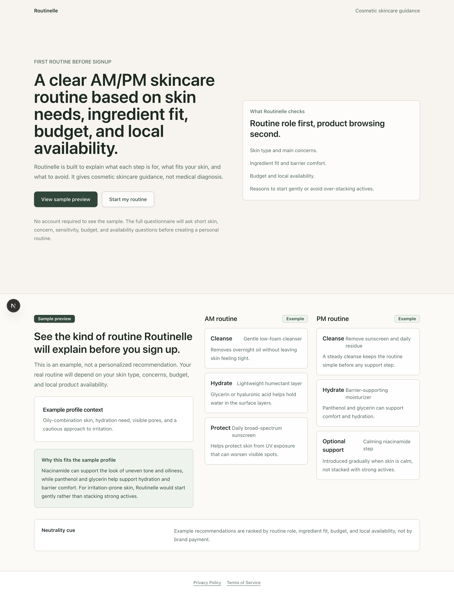
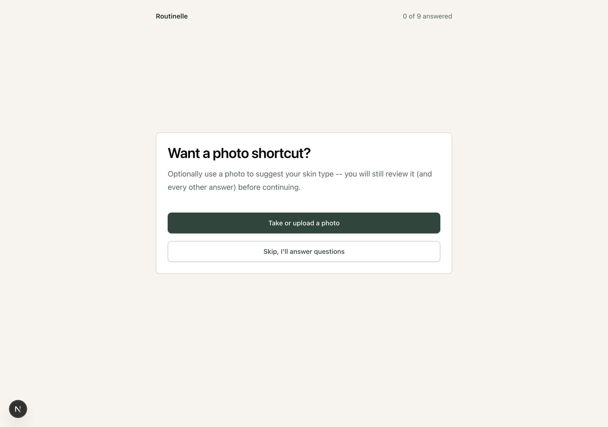
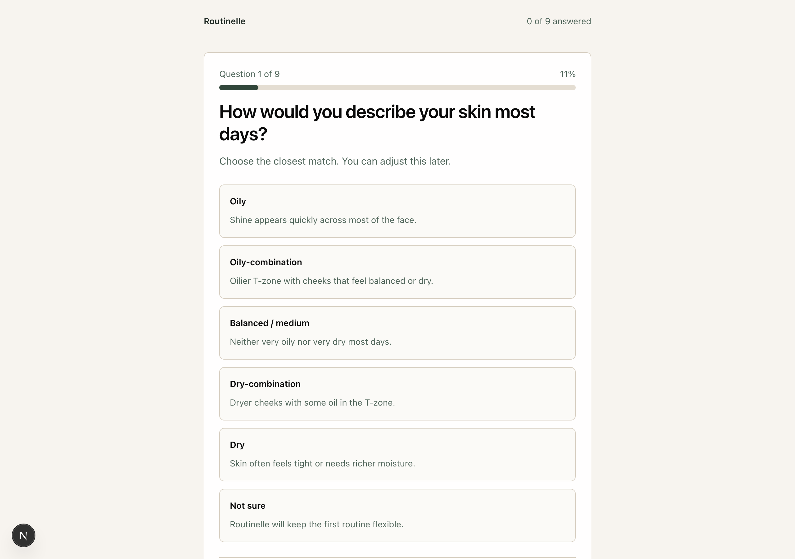
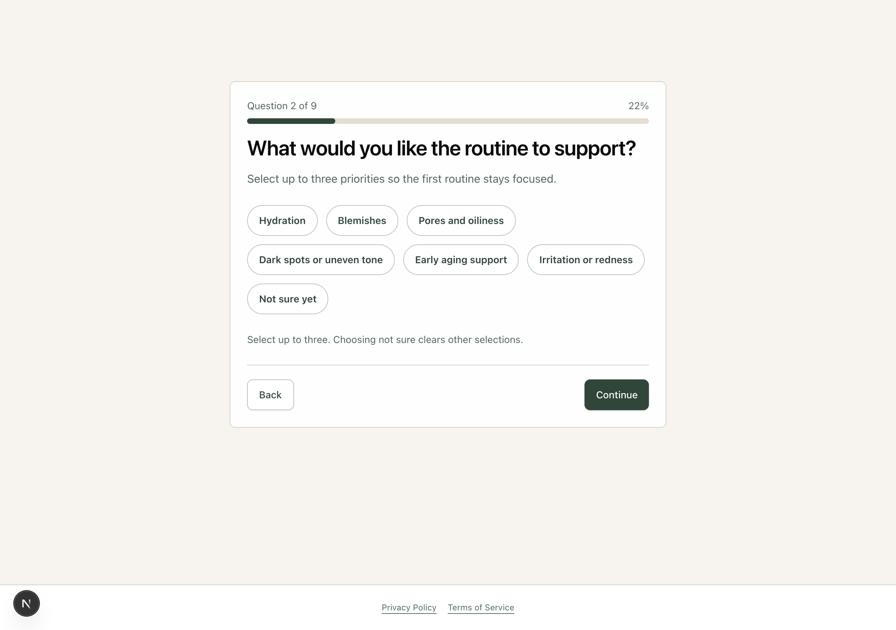
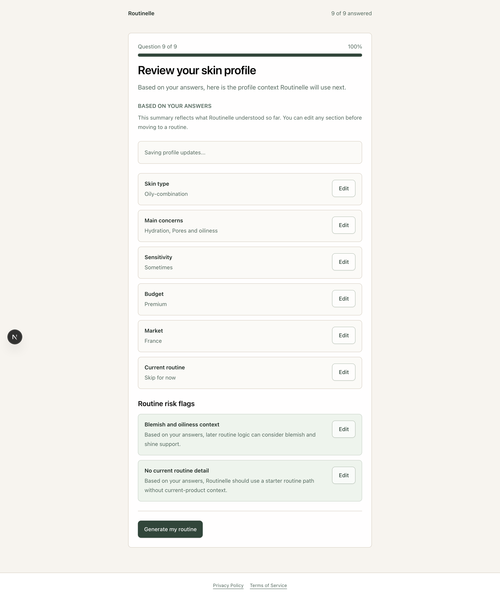
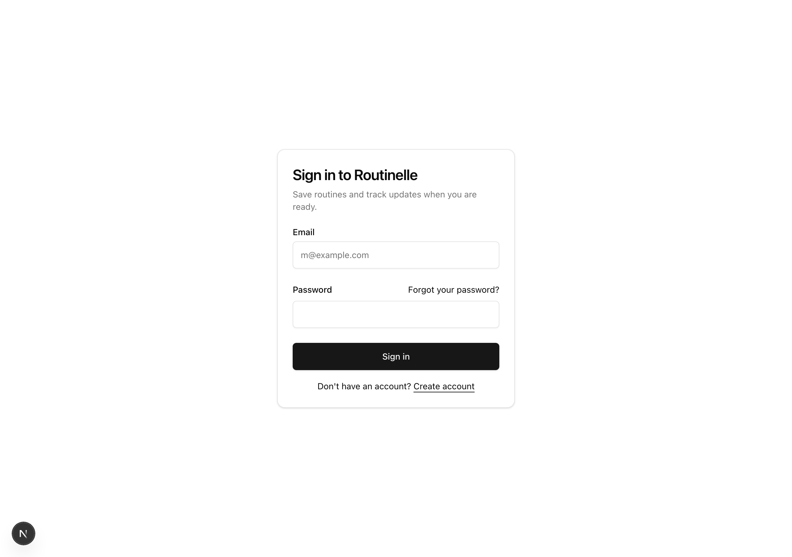

# Routinelle

Routinelle is a mobile-first, cosmetic-only skincare guidance app. It builds a
personal AM/PM routine from a short questionnaire (or an optional photo
shortcut), explains *why* each step was chosen, and stays deliberately
conservative about anything that looks like it needs a dermatologist rather
than a skincare routine.



## What it does

- **Sample routine before signup.** Anyone can see the kind of AM/PM routine
  Routinelle produces, with reasoning, before creating an account.
- **9-question onboarding**, with an optional photo-based skin-type shortcut
  (see below) — skin type, concerns, sensitivity, acne/oiliness and
  irritation/barrier signals, a dedicated safety-signal question, current
  routine basics, budget, and local market.
- **Rule-based routine generation** — no LLM in the recommendation path
  itself. Routines are built from an explicit rules engine over a real
  product catalog (skin fit, budget band, market availability, ingredient
  conflicts), so recommendations are explainable and reproducible.
- **Safety-first escalation.** A dedicated question about swelling, spreading
  discomfort, symptoms near eyes/lips, or persistent/worsening signs can
  redirect the flow to a "seek professional care" message instead of a
  routine — this path is driven only by the user's own answer, never
  second-guessed or overridden by anything else in the app (including the
  photo-analysis feature).
- **Save routines and revisit them**, with 7-day check-ins (structured
  comfort/irritation/progress signals, no free-text symptom collection) that
  feed into future guidance.
- **Admin tooling** for catalog products, catalog governance (copy blocks and
  tags), catalog coverage gaps, and a safety/analytics review dashboard.

### Optional photo-based skin-type suggestion

During onboarding, instead of manually answering the skin-type question,
users can optionally take or upload a photo. It's sent once to a vision model
(Anthropic `claude-haiku-4-5`) for a cosmetic-only impression (skin type and
maybe visible concerns) — never a diagnosis — and the photo itself is never
stored anywhere. The suggestion is only ever a pre-filled, editable answer;
the user reviews it like any other answer before continuing. Requires its
own explicit, point-of-collection consent, separate from account-level
privacy consent.

## Screenshots

| Onboarding entry (photo shortcut, optional) | A manual question |
| --- | --- |
|  |  |

| Multi-select question | Review before generating a routine |
| --- | --- |
|  |  |



## Tech stack

- [Next.js 16](https://nextjs.org/) (App Router, TypeScript)
- [Supabase](https://supabase.com/) — Postgres, Auth, Row-Level Security
- [Tailwind CSS](https://tailwindcss.com/) + [shadcn/ui](https://ui.shadcn.com/)
- [Upstash Redis](https://upstash.com/) — rate limiting
- [Sentry](https://sentry.io/) — error monitoring (deliberately minimal: no
  session replay, no default PII capture, given check-in/safety answers are
  health-adjacent)
- [Anthropic Claude](https://www.anthropic.com/) (`claude-haiku-4-5`) — vision
  model for the optional photo-based skin-type suggestion only
- [Vitest](https://vitest.dev/) for unit tests, [Playwright](https://playwright.dev/)
  for end-to-end tests

## Project structure

```
src/app/(consumer)/   Public + consumer-facing screens (onboarding, account, routines)
src/app/admin/        Internal admin screens (catalog products, governance, coverage, review)
src/app/api/          Route handlers
src/app/auth/         Sign in / sign up / password flows
src/app/privacy/      Privacy Policy
src/app/terms/        Terms of Service
src/components/ui/    shadcn/ui primitives
src/components/routinelle/   Product-specific components
src/lib/domain/       Core domain types and business rules
src/lib/catalog/      Catalog product validation, coverage, governance
src/lib/recommendation/  The routine-generation rules engine
src/lib/safety/       Cosmetic-claim guardrails and safety-escalation logic
src/lib/explanations/ Routine rationale/explanation building
src/lib/vision/       Anthropic vision client + schema for the photo feature
src/lib/supabase/     Supabase client + data-access utilities
supabase/migrations/  Database schema migrations
supabase/seed/        Minimal local-dev seed data
e2e/                  Playwright end-to-end suite
```

## Local setup

Install dependencies:

```bash
npm ci --legacy-peer-deps
```

Create local environment variables:

```bash
cp .env.example .env.local
```

Fill in at least the public Supabase values in `.env.local`:

```env
NEXT_PUBLIC_SUPABASE_URL=
NEXT_PUBLIC_SUPABASE_PUBLISHABLE_KEY=
```

Upstash (rate limiting), Sentry, and `ANTHROPIC_API_KEY` (the photo-suggestion
feature) are all optional for local dev — the app degrades gracefully without
them (rate limiting no-ops, error monitoring is skipped, and the photo step
returns a graceful "unavailable" outcome that falls back to manual
questions). Never commit `.env.local` or any Supabase secret/service-role key.

## Development

```bash
npm run dev
```

The dev script uses Next.js with webpack rather than Turbopack, because the
Turbopack dev server can panic while compiling the auth proxy in some local
environments. Production builds still use the standard Next.js build
pipeline. Open `http://localhost:3000`.

## Verification

```bash
npm run lint        # ESLint
npm run typecheck    # tsc --noEmit
npm run test          # Vitest unit tests
npm run test:e2e     # Playwright end-to-end suite
npm run build         # production build
```

A local `.githooks/pre-push` hook runs lint/typecheck/tests before every
push as a safety net.

### Automated tests

- **Unit tests** (Vitest) cover domain logic, catalog validation, the
  recommendation engine, safety guardrails, and the vision-analysis schema.
- **End-to-end tests** (Playwright) cover auth guards, the full anonymous
  consumer journey (onboarding → routine → save → view), the admin flow
  (create → publish → verify a product appears in recommendations), and
  budget-band matching. These run against a real Supabase project via a
  dedicated `e2e/` fixture setup (isolated test users, cleaned up after each
  run) and are wired into CI.

## Database

Apply migrations in `supabase/migrations/` in filename order. The included
seed only covers a minimal MVP catalog (`supabase/seed/001_mvp_catalog.sql`,
four France-market products); the actual working catalog is populated
directly against the target Supabase project (currently dozens of real
products across France/US/UK markets, spanning low/moderate/premium/luxury
price bands) rather than committed as seed data.

```bash
psql "$DATABASE_URL" -f supabase/seed/001_mvp_catalog.sql
```

If you use the Supabase CLI, `supabase/seed.sql` includes the same seed and
can be picked up by `supabase db reset`.

## Safety and privacy approach

Routinelle gives cosmetic guidance only — it never diagnoses or treats.
Guardrails include an allow-listed cosmetic-copy checker
(`src/lib/safety/claim-guardrails.ts`), a routine-safety validator that can
block a routine entirely in favor of a professional-care message, and a
"structured signals only" policy for anything health-adjacent (check-ins and
safety events log fixed-option signals, never free-text symptom
descriptions). See [`/privacy`](src/app/privacy/page.tsx) and
[`/terms`](src/app/terms/page.tsx) for the full policies.
